## part 0 

Навайбкодили сервис

Исходник сервиса: [`src/app.go`](./src/app.go).

## part 1

Проверим сервис

Запускаем приложение. Оно начинает слушать на порту 8080.
Проверим его здоровье и с помощью команды ps получим pid (16888)

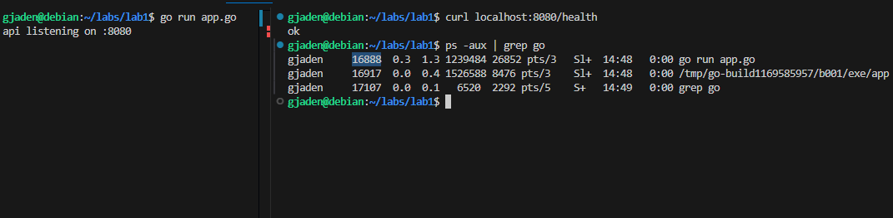


## part 2

запустим процесс в выделенных неймспейсах с помощью `unshare`. 

Флаг  `--fork` необходим для того, чтобы для process  namespace процесс создался сразу в выделенном **process** неймспейсе. Без указания этого флага, только дочерние процессы запущенного процесса будут запускаться в выделенном процессорном неймспейсе.

Флаг `--mount-proc` нужен, чтобы перемонтировать директорию `/proc` для нового PID неймспейса.

Флаг `--map-root-user` делает так, что текущий UID:GID пользователя с хоста отображался как 0:0 (root:root) внутри нового user namespace.

Остальные флаги означают создание разных видов неймспейсов (соответствуют первой букве названия неймспейса, при этом U = user, -u = uts)

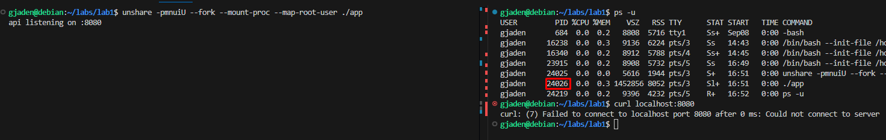

найдем его айди и с  помощью команды `nsenter`,  которая позволяет запускать процессы в неймспейсах других процессов, запустим `bash`.


Что каждый неймспейс изолировал:
- PID - внутри неймспейса наше приложение имеет PID 1, а на хосте у него другой PID.
- User - внутри неймспейса процесс запущен от пользователя root, а на хосте от gjaden.
- Network - свой сетевой стек. Биндинги портов не пересекаются, свой lo интерфейс внутри.
- UTS - внутри можно менять hostname независимо от хоста.
- Mount - отдельная таблица монтирований.
- IPC - изолируются IPC-объекты вроде shared memory, semaphores и message queues.


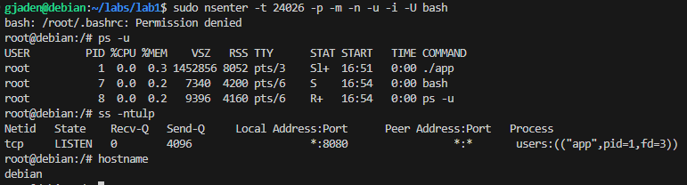

Проверим работу нашего сервиса внутри неймспейсов. Потратим 15 минут на то, чтобы понять, что loopback интерфейс в новом неймспейсе ВЫКЛЮЧЕН.  влючим его и всё работает

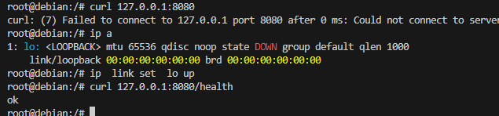

## Part 3 - cgroups
**Cgroups** - это механизм ядра Linux, позволяющий ограничивать процессы по ресурсам: CPU, Memory, IO, Devices, PID.

Управление cgroups происходит  с помощью псевдофайловой системы, которая монтируется в `/sys/fs/cgroup`

### Настройка cgroup

Создадим cgroup "lab1":
`sudo mkdir /sys/fs/cgroup/lab1`

Установим лимит по памяти в 100 мегабайт:
`echo $((100*1024*1024)) | sudo tee /sys/fs/cgroup/lab1/memory.max`

Установим лимит по CPU:
`echo  "50000 100000" | sudo tee /sys/fs/cgroup/lab1/cpu.max`

Данный формат означает, что из каждых 100 000 микросекунд (100 мс) cgroup'е будет доступно 50 мс процессорного времени, то есть полядра.

Установим лимит по количеству pid  в 10 штук:
`echo "10" | sudo tee /sys/fs/cgroup/lab1/pids.max`

И, наконец, добавим наш процесс в cgroup "lab1":
`echo "27464" | sudo tee  /sys/fs/cgroup/lab1/cgroup.procs`

### Проверка и поправки (не в конституции)

Проверим работу ограничения памяти (у нас оно установлено в 100 мб).

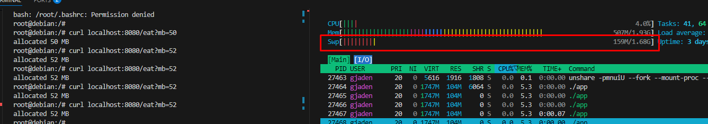

Наш процесс был прибит. В `/sys/fs/cgroup/lab1/memory.events` увидим что счетчик oom_kill повысился на 1.
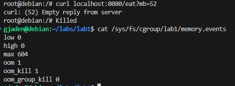

Дальше проверим работу ограничения по CPU.

"Сожгём" одно ядро и посмотрим статистику cgroup по cpu (`cat /sys/fs/cgroup/lab1/cpu.stat`

Видим что процессы тротлятся и CPU съелся на 50%, вместо 100% (на этой виртуалке у меня всего одно ядро)

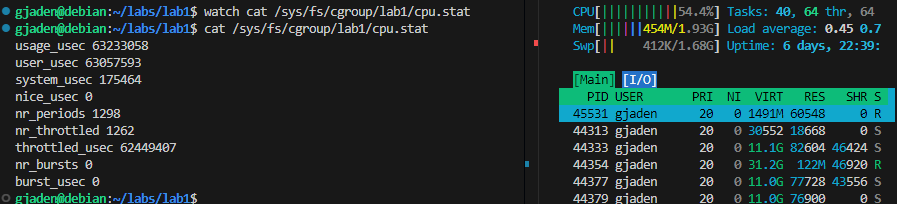

Проверим ограничение по pid. Для этого создадим процесс bash в неймспейсах изолированного app, добавим этот баш в ту же cgroups и запустим форк-бомбу с помощью команды `stress-ng --fork`.
Видим, что я попросил сделать 20 форков но появилось всего несколько (4 штуки) при ограничении в 10 pids. pids так же считает kernel tasks, и наше приложение app работает в 5 потоков. 5 + 4 + 1 (bash) = 10.

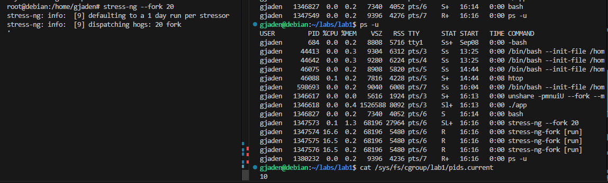

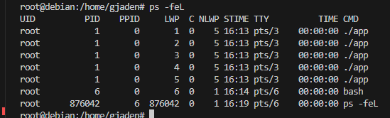

### Послесловие

Автор решил было применить русскую смекалочку: в целях экономии времени, запустить процесс в фоном режиме, дабы сразу же получить его pid. Выглядело это как-то так: `unshare .... &`.
НО Автор не учёл, что получает айди не самого изолята (app), а процесса unshare и успел настрадаться, перед тем как понял свою ошибку. Мораль думайте сами.

## Part 4 - privileges

### Capabilities

**Capabilities** - система разделения привилегированных прав в Linux. Сумма всех этих прав - права privileged процессов, то есть процессов, исполняемых от пользователя с ID 0 (root).

Каждый процесс имеет пять 64-битных чисел (наборов), содержащих биты разрешений, которые можно посмотреть в
> /proc/:pid/status

Для управления capabilities процесса будем использовать утилиту `capsh`.

С помощью команды `unshare -pmnuiU --fork --mount-proc --map-root-user capsh --drop=all --caps="" -- -c './app'` запустим процесс, убрав все привилегии.

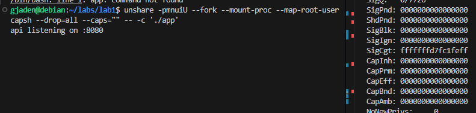

Зайдя в "контейнер", в `/proc/1/status` находим индикаторы Capabilities и видим что они нулевые. Значит ограничение сработало.

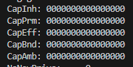

Для проверки попробуем запустить наше приложение на привилегированном порту (< 1024).

Получаем ошибку: не хватает прав, чтобы запустить приложение на 14 порту. При этом без ограничения capabilities, так как внутри неймспейсов наш процесс - root, все capabilities ему доступны и он может спокойно слушать порт 14.

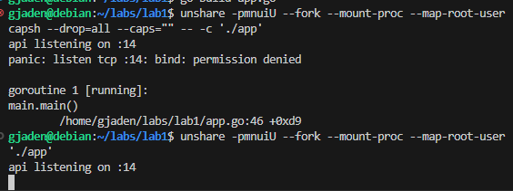

### Seccomp

**Seccomp** - secure computing, фича ядра Линукса, позволяющая ограничивать системные вызовы (syscall), которые может делать процесс.

Системный вызов — это обращение программы к ядру. Например, когда программа хочет открыть файл, создать сокет, выделить память, запустить новый процесс или изменить права, она в итоге вызывает syscalls.

Загруженный фильтр работает как **BPF** (механизм, позволяющий запускать программы в kernel-space).

Наличие фильтров можно увидеть в `/proc/:pid/status`

Предисловие:

Готовой (как мы любим) линуксовой утилиты я не нашел, поэтому пришлось вайбкодить свою, на сях. Я (мой агент) назвал её `seccomp-run`. Если ты - другой студент и читаешь мою лабу, то можешь не убиваться в поисках лёгкого способа настройки seccomp для процессов в Linux, ведь его НЕТ (если есть - пишите в ЛС), а взять готовый бинарь или код из папки с материалами к лабе. Это мой подарок миру.

Материалы: [`seccomp-run.c`](./misc/seccomp-run.c), [готовый `seccomp-run`](./misc/seccomp-run) и [профиль `seccomp.json`](./misc/seccomp.json).

Build:
```
cc -O2 -Wall -Wextra \
    seccomp-run.c \
    -lseccomp \
    -ljson-c \
    -lcap \
    -o seccomp-run
```

Для теста добавим в приложение ручку, делающую syscall "uname" и заблокируем этот вызов.

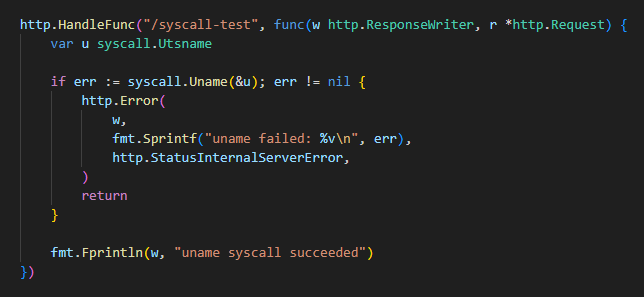

При запуске без ограничений всё работает:

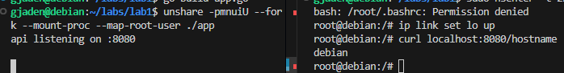

Запустим в процесс с ограничением на системный вызов "uname". Вызов блокируется.

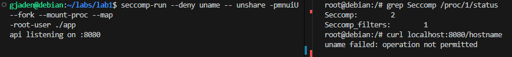

## Part 5 - Assemble your Docker

Команды из предыдущих пунктов были объединены для создания аналога докера, который мы будем продавать за большие деньги.

Для работы скрипта рядом с директорией запуска должен лежать профиль seccomp.json. В данном случае мы положили тот, что используется в докере.

Файлы: [`misc/mydocker.sh`](./misc/mydocker.sh) и [`misc/seccomp.json`](./misc/seccomp.json).

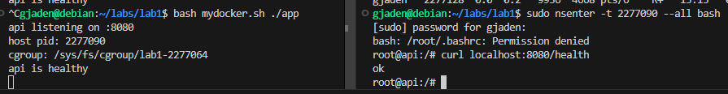

Наш скрипт и докер используют те же базовые механизмы Линукса: namespace, cgroup, capabilities, seccomp.

Главные отличия: 
- Файловая система. Докер создает отдельный rootfs из слоёв, а наша изоляция всего лишь изолирует таблицу монтирований. В нашем скрипте нет поддержки volumes.
- Сеть. Докер создает виртуальный интерфейс veth для контейнера и подключает его к bridge. Так же можно настроить port-forwarding.
- То, что есть в докере, а у нас нет: DNS, логи, управление жизненным циклом контейнера (перезапуски и т.д.), прокидывание переменных окружения.

## Part 6 - Images

Создадим 2 Dockerfile. Один будет базироваться на базовом слое go, второй с помощью multistage соберем и нужное для runtime запустим в scratch.

Dockerfile'ы: [`src/Dockerfile.minimal`](./src/Dockerfile.minimal) и [`src/Dockerfile.multistage`](./src/Dockerfile.multistage).

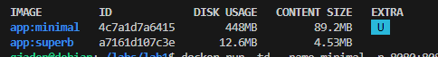

Разница в размерах образов - в 20 раз!

Финальный образ первого докерфайла содержит 8 слоев, а multistage - один слой.

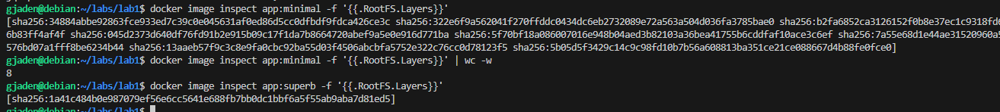

После запуска контейнера, изменения, вносимые в файловую систему внутри него, сохраняются в слой "upperdir", который удаляется вместе с удалением контейнера. 
Проверим:

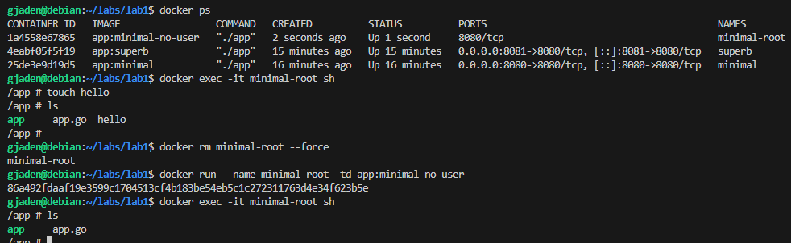

Действительно, созданный файл не сохранился.

Для сохранения изменений, можно использовать volume - персистентное хранилище, которое можно смонтировать в контейнер.

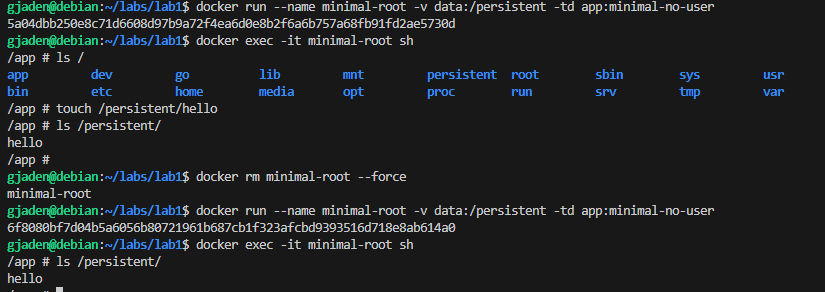

## Part 7 — When a container isn't enough

gVisor - рантайм среда для контейнеров. Этот инструмент предназначен для предоставления безопасной среды, в которой можно запускать что угодно не боясь за здоровье хоста: навайбкоженные приложухи, непроверенный код. А всё потому, что данная утилита предоставляет имитацию интерфейса ядра линукса, написанную на языке Go, поверх которой уже запускаются сами процессы. Он имитирует для приложения значительную часть поведения ядра, реализуя функционал syscalls, processes, fs, network и другие интерфейсы. Это полностью изолирует процесс от прямых системных вызовов в ядро хоста. При этом сам gVisor всё равно работает поверх Linux и при необходимости делает ограниченный набор системных вызовов к ядру хоста. Такой подход к изоляции называется app kernel.

Для использования gVisor будем пользоваться утилитой runsc ("run Sandboxed Container").

После установки пакета, в докер появился выбор runtime "runsc" (вместо стандартного runc).

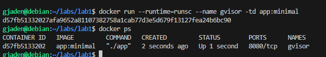

## Part 8 — Monitoring
