## Part 0 — Your service

### Предисловие

В качестве окружения для развертывания буду использовать уже имеющийся у меня двухнодовый кластер k8s, который содержит (хвастаюсь):

- развернутый прометеус с графаной (Их конфигурацию я опишу в следующей главе)
- metallb для получения кластером внешнего айпишника
- external-dns для регистрации ingress доменов в DNS
- cert-manager для работы https (CA самоподписной и доверен в системе)
- ingress nginx controller (да, устарел, но терпим) для получения трафика в кластер
- argocd для деплоя
- proxmox-csi - container storage interface, позволяющий отрезать PV для использования в прикладах кластера
- forgejo для хранения git репозиториев (там храним манифесты для применения argo)

К моему удивлению, всё это более менее стабильно работает и даже почти не отваливается.

ArgoCD позволяет устанавливать хельм чарты, однако сам чарт он не устанавливает, так как абстракция `helm release` в арго заменена абстракцией `application`, поэтому он сам рендерит манифесты из шаблонов и применяет их.

### Подготовка

Для начала соберём образ и запушим его в локальный registry (у меня используется `forgejo`). Файлы сервиса находятся в [`Dockerfile`](Dockerfile) и каталоге [`src`](src/).

Работает он у меня без шифрования, поэтому в файл `/etc/docker/daemon.json` добавим следующие строки:

```json
{ 
"insecure-registries":[
                "192.168.0.242:3000"
        ] 
}
```

Логинимся, билдим и пушим образ в регистри.


### Сервис

Напишем для него [Helm Chart](helm/lab2-app/): для начала создадим шаблон чарта командой `helm create lab2-app`.

Из коробки создаются шаблоны для всех нужных нам ресурсов:
- Деплоймент
- Сервис
- Ингресс (не обязательно, но я заиспользую)

Нам остаётся лишь настроить нужные values.

Включим ingress на домен `lab-1-app.homelab.internal` в [`values.yaml`](helm/lab2-app/values.yaml):

```yaml
ingress:
  enabled: true
  className: "nginx"
  annotations:
    cert-manager.io/cluster-issuer: homelab-ca
  hosts:
    - host: lab-2-app.homelab.internal
      paths:
        - path: /
          pathType: ImplementationSpecific
  tls:
    - secretName: lab2-app-tls
      hosts:
        - lab-2-app.homelab.internal
```

Настроим пробы:

```yaml
livenessProbe:
  httpGet:
    path: /health
    port: http
readinessProbe:
  httpGet:
    path: /health
    port: http
```

Проставим нужный порт на котором слушает контейнер, для сервиса:

```yaml
service:
  type: ClusterIP
  port: 8080
```

Чарт готов. Соберём и запушим его в registry.

```bash
helm package .
curl --user $user:$password -X POST --upload-file ./lab2-app-1.0.0.tgz http://192.168.0.242:3000/api/packages/gjaden/helm/api/charts
```

Проверим что чарт присутствует в удаленном репозитории:

```bash
helm repo add --username $user --password $password forgejo http://192.168.0.242:3000/api/packages/gjaden/he
lm
"forgejo" has been added to your repositories

helm repo update
Hang tight while we grab the latest from your chart repositories...
...Successfully got an update from the "forgejo" chart repository
...Successfully got an update from the "jellyfin" chart repository
...Successfully got an update from the "metallb" chart repository
...Successfully got an update from the "cilium" chart repository
...Successfully got an update from the "argo" chart repository
...Successfully got an update from the "cnpg" chart repository
...Successfully got an update from the "stirling-pdf" chart repository
Update Complete. ⎈Happy Helming!⎈

helm search repo forgejo 
NAME                    CHART VERSION   APP VERSION     DESCRIPTION                
forgejo/lab2-app        1.0.0           1.0.0           A Helm chart for Kubernetes
```

Для деплоя сервиса необходимо добавить его в git репо, куда смотрит мой ArgoCD.

ApplicationSet ArgoCD ищет описание чарта по пути `*/helm/*/app.yaml` и его values в файле `values.yaml` рядом:
```yaml
apiVersion: argoproj.io/v1alpha1
kind: ApplicationSet
spec:
  generators:
  - git:
      files:
      - path: '*/helm/*/app.yaml'
      repoURL: ssh://forgejo@192.168.0.242:2222/gjaden/argocd.git
      revision: HEAD
  goTemplate: true
  goTemplateOptions:
  - missingkey=error
  ignoreApplicationDifferences:
  - jsonPointers:
    - /spec/syncPolicy
  template:
    metadata:
      name: '{{ .name }}'
    spec:
      destination:
        namespace: '{{ .namespace }}'
        server: https://kubernetes.default.svc
      project: default
      sources:
      - chart: '{{ .chart.name }}'
        helm:
          releaseName: '{{ .releaseName }}'
          valueFiles:
          - $values/{{ .path.path }}/values.yaml
        repoURL: '{{ .chart.repoURL }}'
        targetRevision: '{{ .chart.version }}'
      - ref: values
        repoURL: ssh://forgejo@192.168.0.242:2222/gjaden/argocd.git
        targetRevision: HEAD
      syncPolicy:
        automated:
          prune: true
          selfHeal: true
        syncOptions:
        - CreateNamespace=true
        - ServerSideApply={{ dig "serverSideApply" false . }}
```

Лезем на каждую ноду и там прописываем insecure registry...

Но не бойтесь, ведь вся работа ведется по аджайлу: сначала делаем плохо, и создаем таску на то, чтобы переделать нормально:


В репозитории, куда смотрит ArgoCD, создаём пару файликов:


[`app.yaml`](argo/study/helm/lab-2-app/app.yaml), описание чарта:

```yaml
name: lab-2-app
chart:
  repoURL: http://192.168.0.242:3000/api/packages/gjaden/helm
  version: 1.0.0
  name: lab2-app
namespace: lab-2
releaseName: lab2-app
```

[`values.yaml`](argo/study/helm/lab-2-app/values.yaml), дополнительные values (тут пропишем путь но образа):

```yaml
image:
  repository: 192.168.0.242:3000/gjaden/app-1
  # This sets the pull policy for images.
  pullPolicy: IfNotPresent
  # Overrides the image tag whose default is the chart appVersion.
  tag: "1.0.0"
```

Пушим изменения в главную ветку, заходим в интерфейс Арго и видим, что наше приложение успешно засинхронизировалось в кластер:


И даже доступно через ingress-controller по хттпс:


## Part 1 — Metrics (Prometheus + Grafana)

Аналогичным приложению образом у меня в кластере развернут Prometheus + Grafana, при помощи чарта `kube-prometheus-stack` (его values лежат в [`argo/infrastructure/helm/kube-prometheus-stack/values.yaml`](argo/infrastructure/helm/kube-prometheus-stack/values.yaml)).

Для того, чтобы прометеус собирал метрики с нашего приложения, нужно задеплоить ресурс `servicemonitor` или `podmonitor`, чтобы указать прометеусу, откуда и как собирать метрики.

Добавим в чарт ресурс [`servicemonitor`](helm/lab2-app/templates/monitoring/servicemonitor.yaml). В селекторе укажем лейбл, по которому прометеус найдет сервис нашего приложения. Параметризуем путь до метрик и интервал их сбора.

```yaml
apiVersion: monitoring.coreos.com/v1
kind: ServiceMonitor
metadata:
  name: {{ include "lab2-app.fullname" . }}
  labels:
    {{- include "lab2-app.labels" . | nindent 4 }}
spec:
  selector:
    matchLabels:
      app.kubernetes.io/name: {{ include "lab2-app.fullname" . }}
  endpoints:
    - port: http
      interval: {{ .Values.servicemonitor.interval }}
      path: {{ .Values.servicemonitor.path }}
```

Включим мониторинг, добавив в values следующие строчки:

```yaml
servicemonitor:
  enabled: true
  interval: 30s
  path: /metrics
```

Апнем версию чарта по минору, запушим в регистри, поднимем версию в репо и видим успешный результат:


Дополнительно в values Прома в prometheus.prometheusSpec добавим

```yaml
serviceMonitorSelectorNilUsesHelmValues: false
serviceMonitorSelector: {}
serviceMonitorNamespaceSelector: {}
podMonitorSelectorNilUsesHelmValues: false
```

Для того, чтобы Пром подтягивал любые servicemonitor и podmonitor, а не только с указанными лейблами и в указанных неймспейсах.

В логах приложения видим, что прометеус периодически опрашивает ручку /metrics. Значит всё работает.

```log
{"timestamp":"2026-09-26T10:17:41+0000","level":"INFO","message":"request completed","method":"GET","route":"/metrics","status":200,"duration_ms":0.544,"trace_id":"4a894f400aaed3744285f25527848460","span_id":"0e58caa9323d664f"}
{"timestamp":"2026-09-26T10:17:42+0000","level":"INFO","message":"request completed","method":"GET","route":"/metrics","status":200,"duration_ms":0.481,"trace_id":"b514152cffa6a263ed9c4abc9c47a35c","span_id":"b47cbf34aae5fd39"}
{"timestamp":"2026-09-26T10:17:42+0000","level":"INFO","message":"request completed","method":"GET","route":"/metrics","status":200,"duration_ms":1.417,"trace_id":"412d4626bf57e0f69f0981e3a6b06683","span_id":"5ecf83b7a0b6abbe"} 
```

В Проме видим наш таргет healthy


И метрики появились


На основе метрик построил простой RED (Rate, Error, Duration) дашбордик, который выглядит так:


Я сделал 2 секции: overview с общими значениями и detalization (метрики by route), чтобы можно было углубиться, если в overview есть аномалии.

Из интересного: в promql для получения range vector я использовал не хардкод значение (e.g. `[5m]`), а специальную переменную `$__rate_interval`, которая автоматически вычисляет оптимальный интервал на основе данных в зависимости от scrape interval и выбранного диапазона в Графане.

## Part 2 — Logs (Loki + Grafana)

### Хранилище логов - Loki

Первым делом задеплоим Loki ([`app.yaml`](argo/infrastructure/helm/loki/app.yaml), [`values.yaml`](argo/infrastructure/helm/loki/values.yaml)).

Настроим values:

```yaml
deploymentMode: Monolithic

singleBinary:
  replicas: 1
  persistence:
    size: 10Gi

loki:
  storage:
    type: filesystem
  schemaConfig:
    configs:
      - from: "2026-01-01"
        store: tsdb
        object_store: filesystem
        schema: v13
        index:
          prefix: loki_index_
          period: 24h

  limits_config:
    retention_period: 10d
  compactor:
    retention_enabled: true
    delete_request_store: filesystem

backend:
  replicas: 0

read:
  replicas: 0

write:
  replicas: 0

gateway:
  ingress:
    enabled: true
    ingressClassName: "nginx"
    tls:
      - secretName: loki-tls
        hosts:
          - logs.homelab.internal
    hosts:
      - host: logs.homelab.internal
        paths:
          - path: /
    annotations:
      cert-manager.io/cluster-issuer: homelab-ca
```

Я выбрал самый легкий режим работы: "Monolithic". Он рекомендуется при рейте до 10 гб логов в день и должен нам подойти. Также как обычно включаем ingress, настраиваем тип хранилища на локальную fs вместо стандартного удаленного S3. Ставим retention (срок хранения логов) на 10 дней и включаем compactor - компонент, периодически оптимизирующий индексы и удаляющий старые данные по истечение retention.

В блоке loki.schemaConfig указываем что сейчас данные об индексах нужно хранить в формате tsdb и указываем служебные данные, такие как период разбиения индекса.

На моменте деплоя в кластере кончились ресы, поэтому с помощью values вырубаю установку отдельных компонентов кеширования запросов chunksCache и resultsCache:

```yaml
chunksCache:
  enabled: false
resultsCache:
  enabled: false
```

В итоге деплой прошёл успешно

### Сборщик логов - Grafana Alloy

Настроим [`values`](argo/infrastructure/helm/grafana-alloy/values.yaml) для деплоя Grafana Alloy ([`app.yaml`](argo/infrastructure/helm/grafana-alloy/app.yaml)) как агента, собирающего логи с подов и отсылающего их в Loki. Собирать логи он может через Kubernetes API, а локальные логи с нод я получать пока не хочу, да и кластер вот-вот рванет по ресурсам. Поэтому я буду запускать Alloy не в стандартном режиме Daemonset а в виде обыкновенного Deployment в размере одной реплики.

```yaml
controller:
  type: deployment
  replicas: 1
```

Далее необходимо собрать конфиг агента и положить его в `alloy.configMap.content`. Воспользуемся [официальным гайдом](https://grafana.com/docs/alloy/latest/collect/logs-in-kubernetes/).

Первым делом настраиваем компонент discovery для обнаружения pod'ов в кубе. В селекторе прописано интересное правило, условно: spec.nodeName = HOSTNAME. Это позволяет аллою, запущенному в режиме демонсета на каждой ноде, выбирать поды только с ноды, на которой он сейчас запущен, и тем самым избежать дублирования логов.

```yaml
discovery.kubernetes "pod" {
  role = "pod"
  selectors {
    role = "pod"
    field = "spec.nodeName=" + coalesce(sys.env("HOSTNAME"), constants.hostname)
  }
}
```

Далее делаем крутую череду релейблов под дабстеп (пример: имя пода кладем в лейбл "pod"). Заметьте, что в качестве таргетов мы указываем результат (в терминологии alloy вроде бы `export`) предыдущего компонента: `targets = discovery.kubernetes.pod.targets`.

```yaml
discovery.relabel "pod_logs" {
  targets = discovery.kubernetes.pod.targets

  // Label creation - "namespace" field from "__meta_kubernetes_namespace"
  rule {
    source_labels = ["__meta_kubernetes_namespace"]
    action = "replace"
    target_label = "namespace"
  }

  // Label creation - "pod" field from "__meta_kubernetes_pod_name"
  rule {
    source_labels = ["__meta_kubernetes_pod_name"]
    action = "replace"
    target_label = "pod"
  }

  И ТАК ДАЛЕЕ
  ...
```

Следующим шагом тянем логи из подов и отправляем в ресивер следующего компонента.

```yaml
loki.source.kubernetes "pod_logs" {
  targets    = discovery.relabel.pod_logs.output
  forward_to = [loki.process.pod_logs.receiver]
}
```

Клеим статический лейбл с названием кластера и отправляем в `loki.write.grafana_loki`.

```yaml
loki.process "pod_logs" {
  stage.static_labels {
      values = {
        cluster = "homelab",
      }
  }

  forward_to = [loki.write.grafana_loki.receiver]
}
```

И наконец гоним логи в наш инстанс Loki:

```yaml
loki.write "grafana_loki" {
  endpoint {
    url = "http://loki-gateway.monitoring.svc.cluster.local/loki/api/v1/push"
    tenant_id = "homelab"
  }
}
```

Также настроим отправку логов о ивентах кластера:

```yaml
loki.source.kubernetes_events "cluster_events" {
  job_name   = "integrations/kubernetes/eventhandler"
  log_format = "logfmt"
  forward_to = [
    loki.process.cluster_events.receiver,
  ]
}

// loki.process receives log entries from other loki components, applies one or more processing stages,
// and forwards the results to the list of receivers in the component's arguments.
loki.process "cluster_events" {
  forward_to = [loki.write.grafana_loki.receiver]

  stage.static_labels {
    values = {
      cluster = "homelab",
    }
  }

  stage.labels {
    values = {
      kubernetes_cluster_events = "job",
    }
  }
}
```

Деплоим. Но что-то произошло и до docker.io ловим таймаут при пулле образа 🥰:
```
Failed to pull image "docker.io/grafana/alloy:v1.20.0": failed to pull and unpack image
  "docker.io/grafana/alloy:v1.20.0": failed to copy: httpReadSeeker: failed open: failed to do request: Get
  "https://produ │
  │
  ction.cloudfront.docker.com/registry-v2/docker/registry/v2/blobs/sha256/05/0589767014b1aedf0cafcf81f0f6abcb97069df2
  bb0271b7c74e3fe90fa43e0d/data?Expires=1790457985&Signature=MKwas5CztWntODKm42zdidhgehbo0oY2uJUGafN8A3YOdcZDUYnPWSKI
  eLpxKfqpYJ7MvBh~48LIvzz-~gAbzUjs7yEs4ebn
  │
  │ -ta48lTFgjXRMn7h4ZxW7EOS3vm80qjLz-
  D0ULQwnJEma0JSaw7a8JujYOScJR0zw8YoRrmjaJQYCqT4HutAUH~E69dIacS3uxZV45V1FhjhkKWalL6QSUOWwC8gJitcQ7sysJ55XJyh75ytxzI5n
  9wU7ZxDj-BkADQgDD2cDR9L4jCySO9QoZFvsJHZYQyVu7g3voFjf3KFl4g6vTJMx6q0cpvCKbS4FH~sCptTN7SrI7hZxQyesA__&Key-Pair-
  Id=K2C9XPB6F │
  │ LAKUF": net/http: TLS handshake timeout
```

Терпим, руками качаем образ на машине с квн и закидываем на все ноды. Поды успешно поднялись.

Надеваем кепку с вертушкой, берем комически большой леденец и идем в Графану проверять работу нашего поделия. Добавляем датасорс, смотрящий на loki gateway service. В Headers добавляем http header `X-Scope-OrgID` с указанием тенанта в Loki (`homelab`).


NO DATA


Идём смотреть логи. В логах видим пятисотки в Локи и Локи жалуется на то, что ему не хватает реплик. Так как Локи в целях экономии ресурсов у меня запущен в 1 реплике, нужно также задать:

```yaml
loki:
  commonConfig:
    replication_factor: 1
```

Чтобы он работал без репликации.

Запушив я понял, что не мог увидеть логи как минимум потому, что ничего не вписал в query)

В этот раз воспользуемся вкладкой графаны "Drilldown" -> Logs, которая сама строит LogQL запросы.

В этот раз видим логи. Ура


Как ощущается фильтровать логи в интерфейсе новой тулы:


## Part 3 — Traces (OpenTelemetry + Jaeger)

В коде приложения уже реализовано управление трейсами. ID трейса также логируется с каждой записью лога.

Для сбора и хранения трейсов будем использовать сервис Jaeger-all-in-one. Jaeger в данной конфигурации предоставляет collector, хранилище и query компоненты для хранения, сбора и запроса трейсов. Этот вариант подходит для локального развертывания и тестирования. В обычной продовой конфигурации эти компоненты разделены на микросервисы, а в качестве хранилища обычно выступает NoSQL БД с индексным движком, такая как OpenSearch / ElasticSearch.

Раскатили Jaeger с помощью официального [helm chart](https://github.com/jaegertracing/helm-charts/tree/main/charts/jaeger) ([`app.yaml`](argo/infrastructure/helm/jaeger/app.yaml), [`values.yaml`](argo/infrastructure/helm/jaeger/values.yaml))

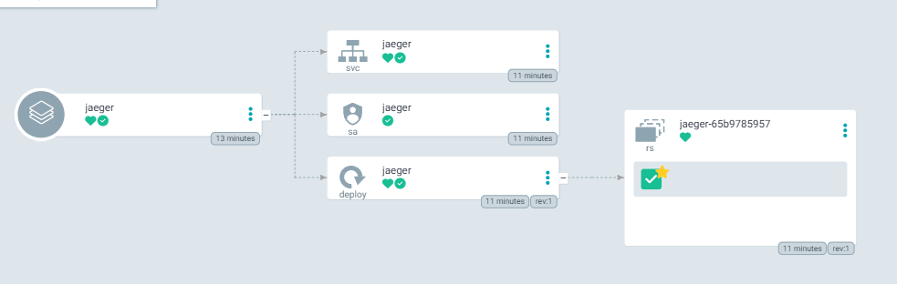

В вальюсы добавлю только ingress.

Адрес http сервиса Jaeger в кластере: `http://jaeger.monitoring.svc.cluster.local:4318`

При помощи env в Deployment, направим трейсы нашего сервиса в jaeger.

```yaml
env:
  - name: OTEL_EXPORTER_OTLP_ENDPOINT
    value: "http://jaeger.monitoring.svc.cluster.local:4318"
```

Работает!

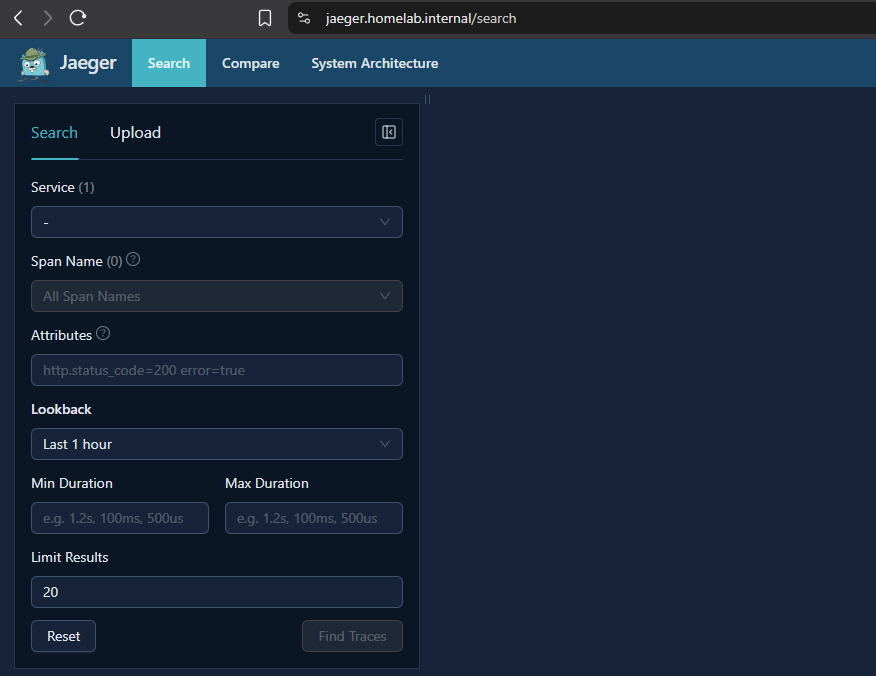

Видим трейсы нашего приложения

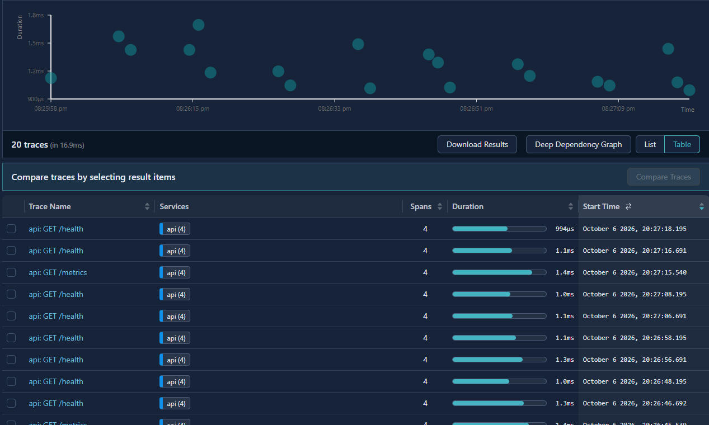

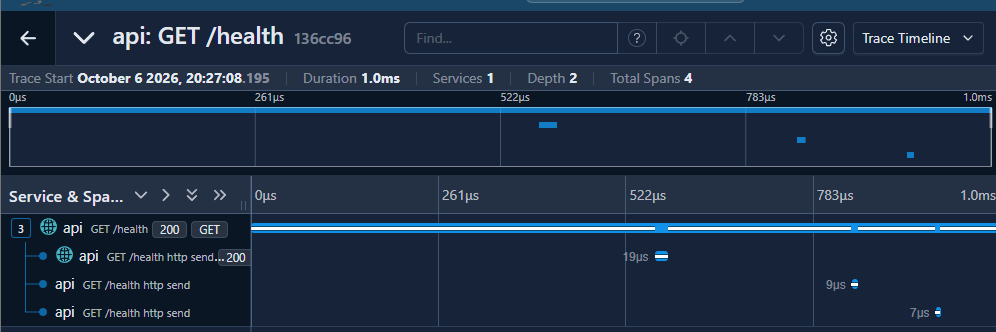

Найдём трейс ручки `/slow`:

Внутри трейса видим спан и 4 дочерних спана. Видно, что бОльшая часть времени была проведена в функции slow-op.

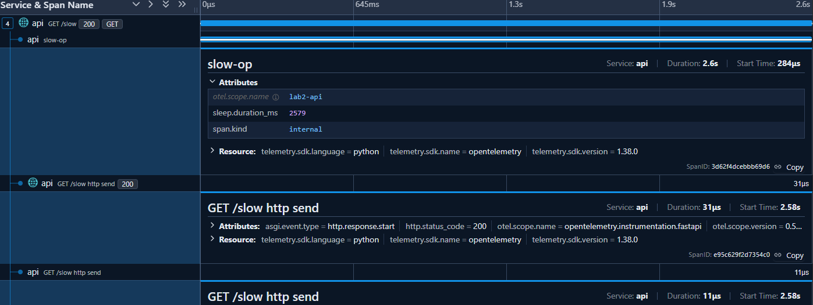

Найдем трейс ручки `fail` и увидим что в трейсе отражена ошибка 500 с подробной информацией о запросе. Сам трейс помечен красным в UI:

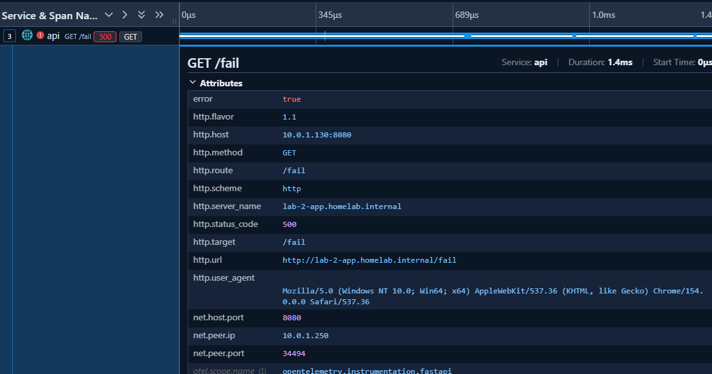

Найдем в графане лог с ошибкой, и возьмём его трейс id.

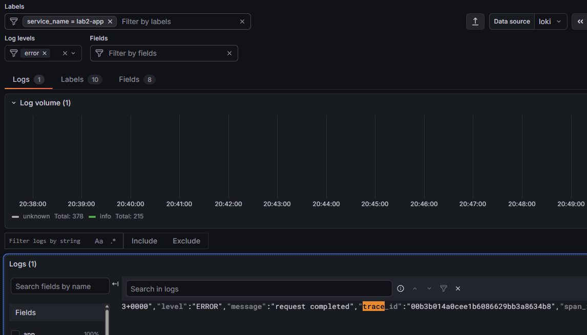

Попробуем найти этот трейс в Jaeger

С помощью поиска трейс был успешно обнаружен

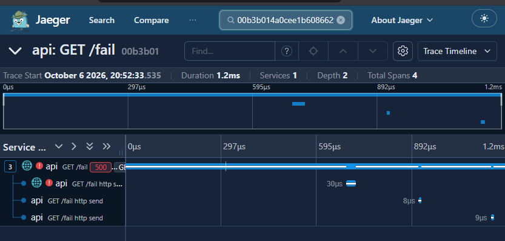

## Part 4 — Alerts (Alertmanager + Karma)

AlertManager уже добавлен в кластер при помощи kube-prometheus-stack (по дефолту, [`values.yaml`](argo/infrastructure/helm/kube-prometheus-stack/values.yaml)).

Алерты для прома будем добавлять при помощи создания ресурсов kind [`PrometheusRule`](helm/lab2-app/templates/monitoring/prometheusrule.yaml).

В прометеусе из коробки прописан конфиг под отправку алертов в алертменеджер, поэтому тут ничего делать не надо.

### Отправка алертов

Prometheus вычисляет правила из ресурсов `PrometheusRule` с заданным интервалом. Если условие правила остаётся истинным в течение времени, указанного в `for`, алерт переходит из состояния `pending` в `firing` и отправляется в Alertmanager. Когда условие перестает выоплняться, пром отправляет в алертменеджер алерт со статусом `resolved`.

Alertmanager занимается группировкой, заглушением, дедупликацией, и доставкой полученных алертов. В моей конфигурации алерты группируются по `namespace` и `alertname`:

```yaml
group_by:
  - namespace
  - alertname
```

Основным ресивером настроен Telegram:

```yaml
route:
  receiver: telegram

receivers:
  - name: telegram
    telegram_configs:
      - bot_token_file: /etc/alertmanager/secrets/alertmanager-telegram/bot-token
        chat_id: 764516044
        send_resolved: true
```

Нормальная доставка секретов в мой куб возможно появится в следующих сериях, а пока подложил id чата и токен бота в секрет вручную.

Также настроим шаблон сообщения:

```yaml
 message: |-
        {{ if eq .Status "firing" }}🔥 АЛЯРМ{{ else }}✅ =Нормально={{ end }}
        {{ range .Alerts }}

        Alert: {{ .Labels.alertname }}
        Severity: {{ .Labels.severity }}
        Namespace: {{ .Labels.namespace }}
        {{ with .Labels.pod }}Pod: {{ . }}{{ end }}
        {{ with .Labels.instance }}Instance: {{ . }}{{ end }}
        {{ with .Annotations.summary }}Summary: {{ . }}{{ end }}
        {{ with .Annotations.description }}Description: {{ . }}{{ end }}
        Started: {{ .StartsAt.Format "2006-01-02 15:04:05 MST" }}
        {{ with .GeneratorURL }}Source: {{ . }}{{ end }}
        {{ end }}
```

### Алерты приложения

Правила находятся в [`values.yaml`](argo/study/helm/lab-2-app/values.yaml).

#### `Lab2ApiHighErrorRate`

Алерт сообщает о деградации успешности запросов. Он вычисляет долю ответов со статусом `5xx` среди всех HTTP-запросов за последние пять минут:

```promql
sum(rate(api_http_errors_total[5m]))
/
clamp_min(sum(rate(api_http_requests_total[5m])), 0.001)
```

Алерт переходит в состояние `firing`, если доля ошибок превышает 5% непрерывно в течение пяти минут. Дежурный должен проверить логи и трейсы ошибочных запросов для локализации проблемы.

#### `Lab2ApiHighLatency`

Алерт сообщает о медленных ответах приложения. Функция `histogram_quantile` вычисляет 95-й перцентиль времени ответа по bucket-метрикам гистограммы:

```promql
histogram_quantile(
  0.95,
  sum by (le) (
    rate(api_http_request_duration_seconds_bucket[5m])
  )
)
```

Алерт срабатывает, если p95 превышает две секунды непрерывно в течение пяти минут. Это означает, что примерно более 5% запросов не укладываются в две секунды. Деж должен определить медленные маршруты по метрикам и трейсам.

#### `Lab2ApiFrequentRestarts`

Алерт обнаруживает нестабильность процесса приложения по счётчику рестартов контейнера:

```promql
increase(
  kube_pod_container_status_restarts_total{container="lab2-app"}[15m]
) > 2
```

Он срабатывает, если контейнер перезапустился более двух раз за 15 минут. Такое поведение может указывает на падение процесса контейнера: например `OOMKilled`, ошибку конфигурации или провал liveness probe. Деж должен проверить `kubectl describe pod`, предыдущие логи контейнера и причину завершения, а затем исправить конфигурацию или лимиты ресурсов либо откатить проблемный релиз.

### Проверка алертов

Помимо триллиона коробочных алертов, говорящих о неправильной работе моей богом забытой хоумлабы, и пришедших после успешной настройки алертменеджера, попробуем стригерить свежесозданные алерты:

Заспамим приложеньку по ручке `slow` с помощью скрипта

```bash
while true; do
  curl -ksS -o /dev/null -w '%{http_code} %{time_total}s\n' https://lab-2-app.homelab.internal/slow;
done
```

Словили алёрт

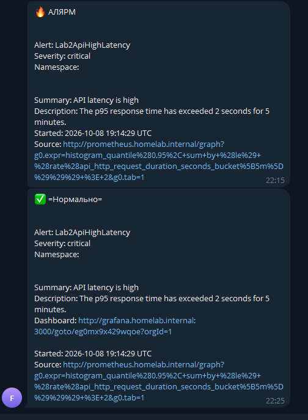

Я знаю что сообщение кривое и можно сделать покрасивее и поинформативнее, но я не хочу отлетать на допсу, так что пришлось с этой лабой поторопиться простите(((

Аналогичным образом словим остальные алёрты

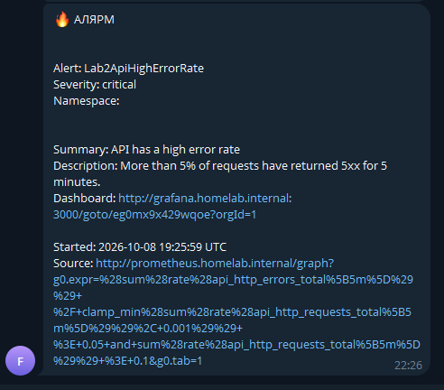

С помощью нехитрых манипуляций (`kill 1`) ловим падение контейнера...

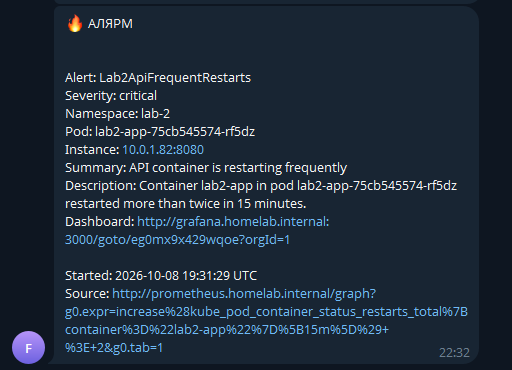

### Karma

Теперь давайте поставим Karma - UI для Alertmanager.

Кластер сейчас ЛОПНЕТ, поэтому карму разверну локально

```bash
docker run --rm --name karma \
    -p 8080:8080 \
    -e ALERTMANAGER_URI=https://alertmanager.homelab.internal \
    -e ALERTMANAGER_EXTERNAL_URI=https://alertmanager.homelab.internal \
    -e ALERTMANAGER_PROXY=true \
    -e ALERTMANAGER_TLS_INSECURE_SKIP_VERIFY=true \
    ghcr.io/prymitive/karma:v0.132
```

Видим алёрты (да, карма у меня плохая, судя по количеству алертов). Тут же их можно группировать, фильтровать.

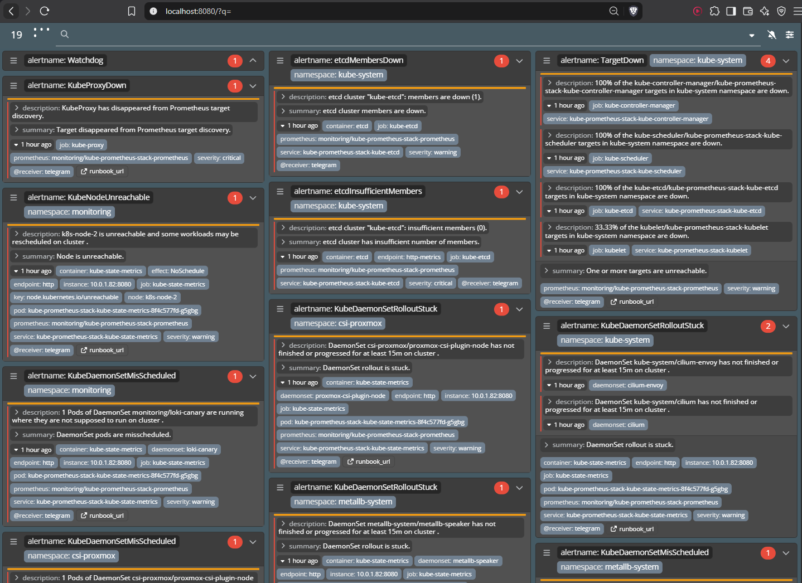
