# Лабораторная работа № 2: наблюдаемость приложения в Kubernetes

В работе приложение упаковывается в Helm chart и разворачивается через Argo CD. Затем для него последовательно настраиваются метрики, логи, трассировки и алерты.

## Содержание

- [Part 0 — Сервис и развёртывание](#part-0--сервис-и-развёртывание)
- [Part 1 — Метрики: Prometheus и Grafana](#part-1--метрики-prometheus-и-grafana)
- [Part 2 — Логи: Loki, Grafana Alloy и Grafana](#part-2--логи-loki-grafana-alloy-и-grafana)
- [Part 3 — Трассировки: OpenTelemetry и Jaeger](#part-3--трассировки-opentelemetry-и-jaeger)
- [Part 4 — Алерты: Alertmanager и Karma](#part-4--алерты-alertmanager-и-karma)

## Part 0 — Сервис и развёртывание

### Предисловие

В качестве окружения для развёртывания буду использовать уже имеющийся у меня двухнодовый кластер Kubernetes, который содержит (хвастаюсь):

- Prometheus и Grafana (их конфигурацию я опишу в следующей главе);
- MetalLB для получения кластером внешнего IP-адреса;
- ExternalDNS для регистрации Ingress-доменов в DNS;
- cert-manager для работы HTTPS (CA самоподписной и доверен в системе);
- ingress-nginx controller (да, устарел, но терпим) для получения трафика в кластер;
- Argo CD для деплоя;
- Proxmox CSI — Container Storage Interface, позволяющий выделять PV приложениям кластера;
- Forgejo для хранения Git-репозиториев с манифестами Argo CD.

К моему удивлению, всё это более менее стабильно работает и даже почти не отваливается.

Argo CD позволяет устанавливать Helm charts, однако не создаёт обычный `Helm release`: в Argo CD он заменён абстракцией `Application`. Argo CD самостоятельно рендерит манифесты из шаблонов и применяет их.

### Подготовка

Исходный код приложения находится в [`src/app.py`](src/app.py), а инструкция сборки — в [`Dockerfile`](Dockerfile). Для начала соберём образ и отправим его в локальный registry Forgejo.

Работает он у меня без шифрования, поэтому в файл `/etc/docker/daemon.json` добавим следующие строки:

```json
{
  "insecure-registries": [
    "192.168.0.242:3000"
  ]
}
```

Логинимся, билдим и пушим образ в регистри.

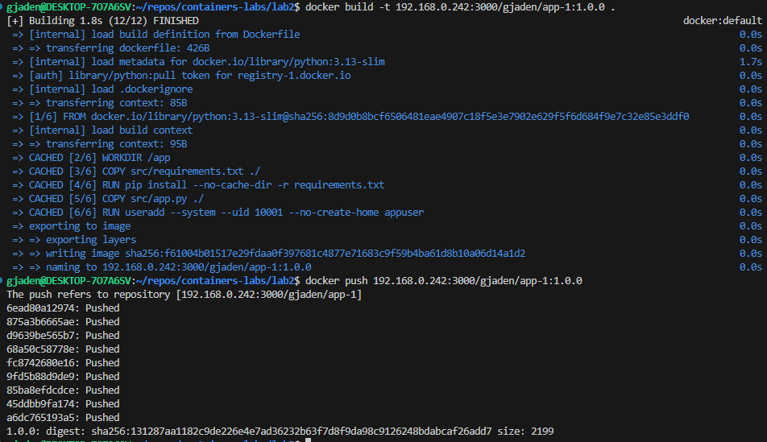

*Сборка и публикация образа приложения.*


### Сервис

Создадим для сервиса [Helm chart](helm/lab2-app/) командой `helm create lab2-app`.

Из коробки создаются шаблоны для всех нужных нам ресурсов:

- Деплоймент
- Сервис
- Ингресс (не обязательно, но я заиспользую)

Нам остаётся лишь настроить нужные values.

Включим Ingress на домене `lab-2-app.homelab.internal` в [`values.yaml`](helm/lab2-app/values.yaml):

```yaml
ingress:
  enabled: true
  className: "nginx"
  annotations:
    cert-manager.io/cluster-issuer: homelab-ca
  hosts:
    - host: lab-2-app.homelab.internal
      paths:
        - path: /
          pathType: ImplementationSpecific
  tls:
    - secretName: lab2-app-tls
      hosts:
        - lab-2-app.homelab.internal
```

Настроим пробы:

```yaml
livenessProbe:
  httpGet:
    path: /health
    port: http
readinessProbe:
  httpGet:
    path: /health
    port: http
```

Проставим нужный порт на котором слушает контейнер, для сервиса:

```yaml
service:
  type: ClusterIP
  port: 8080
```

Chart готов. Соберём и отправим его в registry.

```bash
helm package .
curl --user $user:$password -X POST --upload-file ./lab2-app-1.0.0.tgz http://192.168.0.242:3000/api/packages/gjaden/helm/api/charts
```

Проверим что чарт присутствует в удаленном репозитории:

```bash
helm repo add --username $user --password $password forgejo \
  http://192.168.0.242:3000/api/packages/gjaden/helm
"forgejo" has been added to your repositories

helm repo update
Hang tight while we grab the latest from your chart repositories...
...Successfully got an update from the "forgejo" chart repository
...Successfully got an update from the "jellyfin" chart repository
...Successfully got an update from the "metallb" chart repository
...Successfully got an update from the "cilium" chart repository
...Successfully got an update from the "argo" chart repository
...Successfully got an update from the "cnpg" chart repository
...Successfully got an update from the "stirling-pdf" chart repository
Update Complete. ⎈Happy Helming!⎈

helm search repo forgejo
NAME                    CHART VERSION   APP VERSION     DESCRIPTION
forgejo/lab2-app        1.0.0           1.0.0           A Helm chart for Kubernetes
```

Для деплоя сервиса необходимо добавить его в git репо, куда смотрит мой ArgoCD.

ApplicationSet ArgoCD ищет описание чарта по пути `*/helm/*/app.yaml` и его values в файле `values.yaml` рядом:
```yaml
apiVersion: argoproj.io/v1alpha1
kind: ApplicationSet
spec:
  generators:
  - git:
      files:
      - path: '*/helm/*/app.yaml'
      repoURL: ssh://forgejo@192.168.0.242:2222/gjaden/argocd.git
      revision: HEAD
  goTemplate: true
  goTemplateOptions:
  - missingkey=error
  ignoreApplicationDifferences:
  - jsonPointers:
    - /spec/syncPolicy
  template:
    metadata:
      name: '{{ .name }}'
    spec:
      destination:
        namespace: '{{ .namespace }}'
        server: https://kubernetes.default.svc
      project: default
      sources:
      - chart: '{{ .chart.name }}'
        helm:
          releaseName: '{{ .releaseName }}'
          valueFiles:
          - $values/{{ .path.path }}/values.yaml
        repoURL: '{{ .chart.repoURL }}'
        targetRevision: '{{ .chart.version }}'
      - ref: values
        repoURL: ssh://forgejo@192.168.0.242:2222/gjaden/argocd.git
        targetRevision: HEAD
      syncPolicy:
        automated:
          prune: true
          selfHeal: true
        syncOptions:
        - CreateNamespace=true
        - ServerSideApply={{ dig "serverSideApply" false . }}
```

Лезем на каждую ноду и там прописываем insecure registry...

Но не бойтесь, ведь вся работа ведется по аджайлу: сначала делаем плохо, и создаем таску на то, чтобы переделать нормально:

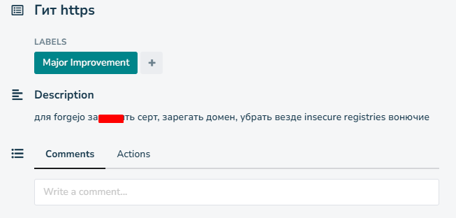

*Технический долг по переводу Forgejo и Registry на HTTPS.*

В репозитории, куда смотрит ArgoCD, создаём пару файликов:

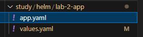

*Описание приложения и его дополнительные values в Git-репозитории Argo CD.*

[`app.yaml`](argo/study/helm/lab-2-app/app.yaml) — описание chart:

```yaml
name: lab-2-app
chart:
  repoURL: http://192.168.0.242:3000/api/packages/gjaden/helm
  version: 1.0.0
  name: lab2-app
namespace: lab-2
releaseName: lab2-app
```

[`values.yaml`](argo/study/helm/lab-2-app/values.yaml) — дополнительные values с адресом образа:

```yaml
image:
  repository: 192.168.0.242:3000/gjaden/app-1
  # This sets the pull policy for images.
  pullPolicy: IfNotPresent
  # Overrides the image tag whose default is the chart appVersion.
  tag: "1.0.0"
```

Пушим изменения в главную ветку, заходим в интерфейс Арго и видим, что наше приложение успешно засинхронизировалось в кластер:

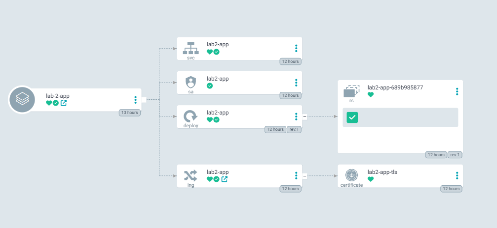

*Ресурсы приложения успешно синхронизированы Argo CD.*

И даже доступно через ingress-controller по хттпс:

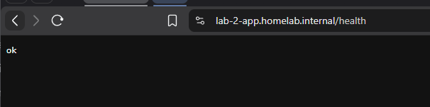

*Проверка `/health` через HTTPS и ingress-nginx.*


## Part 1 — Метрики: Prometheus и Grafana

Prometheus и Grafana развёрнуты в кластере с помощью chart `kube-prometheus-stack`. Его параметры находятся в [`argo/kube-prometheus-stack/values.yaml`](argo/kube-prometheus-stack/values.yaml).

Для того, чтобы прометеус собирал метрики с нашего приложения, нужно задеплоить ресурс `servicemonitor` или `podmonitor`, чтобы указать прометеусу, откуда и как собирать метрики.

Добавим в chart шаблон [`ServiceMonitor`](helm/lab2-app/templates/servicemonitor.yaml). В селекторе укажем label, по которому Prometheus найдёт Service приложения, а путь до метрик и интервал сбора параметризуем через values.

```yaml
apiVersion: monitoring.coreos.com/v1
kind: ServiceMonitor
metadata:
  name: {{ include "lab2-app.fullname" . }}
  labels:
    {{- include "lab2-app.labels" . | nindent 4 }}
spec:
  selector:
    matchLabels:
      app.kubernetes.io/name: {{ include "lab2-app.fullname" . }}
  endpoints:
    - port: http
      interval: {{ .Values.servicemonitor.interval }}
      path: {{ .Values.servicemonitor.path }}
```

Включим мониторинг, добавив в values следующие строчки:

```yaml
servicemonitor:
  enabled: true
  interval: 30s
  path: /metrics
```

Поднимем минорную версию chart, отправим пакет в registry и обновим версию в репозитории Argo CD:

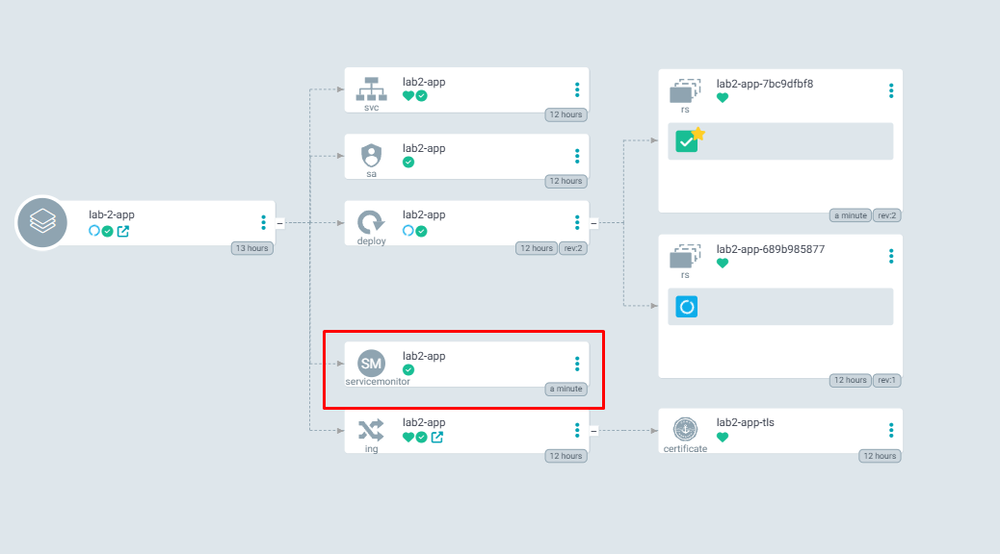

*Argo CD успешно создал `ServiceMonitor` приложения.*

Чтобы Prometheus обнаруживал `ServiceMonitor` и `PodMonitor` независимо от release-label и namespace, добавим в `prometheus.prometheusSpec`:

```yaml
serviceMonitorSelectorNilUsesHelmValues: false
serviceMonitorSelector: {}
serviceMonitorNamespaceSelector: {}
podMonitorSelectorNilUsesHelmValues: false
```

В логах приложения видно, что Prometheus периодически опрашивает endpoint `/metrics`:

```log
{"timestamp":"2026-09-26T10:17:41+0000","level":"INFO","message":"request completed","method":"GET","route":"/metrics","status":200,"duration_ms":0.544,"trace_id":"4a894f400aaed3744285f25527848460","span_id":"0e58caa9323d664f"}
{"timestamp":"2026-09-26T10:17:42+0000","level":"INFO","message":"request completed","method":"GET","route":"/metrics","status":200,"duration_ms":0.481,"trace_id":"b514152cffa6a263ed9c4abc9c47a35c","span_id":"b47cbf34aae5fd39"}
{"timestamp":"2026-09-26T10:17:42+0000","level":"INFO","message":"request completed","method":"GET","route":"/metrics","status":200,"duration_ms":1.417,"trace_id":"412d4626bf57e0f69f0981e3a6b06683","span_id":"5ecf83b7a0b6abbe"}
```

В интерфейсе Prometheus target находится в состоянии `healthy`:

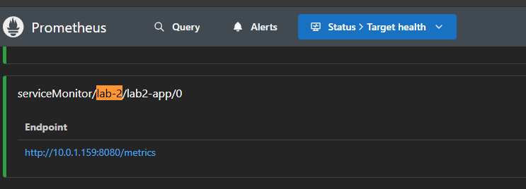

Метрики приложения доступны для запросов:

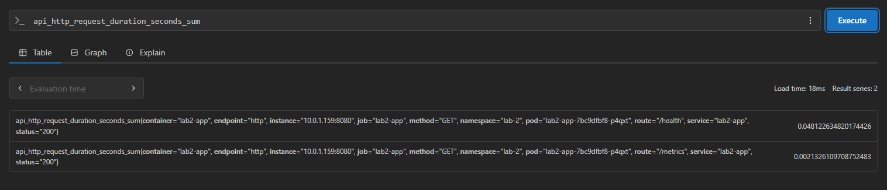

На основе метрик построил простой RED (Rate, Error, Duration) дашбордик, который выглядит так:

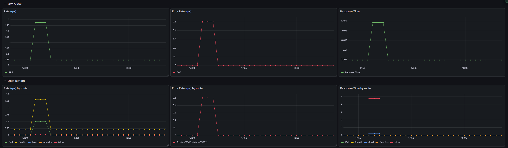

*RED-дашборд: частота запросов, ошибки и время ответа.*

Я сделал две секции: `Overview` с общими значениями и `Detalization` с метриками по маршрутам, чтобы при обнаружении аномалии можно было перейти к деталям.

Из интересного: в promql для получения range vector я использовал не хардкод значение (e.g. `[5m]`), а специальную переменную `$__rate_interval`, которая автоматически вычисляет оптимальный интервал на основе данных в зависимости от scrape interval и выбранного диапазона в Графане.

## Part 2 — Логи: Loki, Grafana Alloy и Grafana

### Хранилище логов — Loki

Первым делом задеплоим Loki.

Настроим values:

```yaml
deploymentMode: Monolithic

singleBinary:
  replicas: 1
  persistence:
    size: 10Gi

loki:
  commonConfig:
    replication_factor: 1

  storage:
    type: filesystem

  schemaConfig:
    configs:
      - from: "2026-01-01"
        store: tsdb
        object_store: filesystem
        schema: v13
        index:
          prefix: loki_index_
          period: 24h

  limits_config:
    retention_period: 10d
  compactor:
    retention_enabled: true
    delete_request_store: filesystem

chunksCache:
  enabled: false

resultsCache:
  enabled: false

backend:
  replicas: 0

read:
  replicas: 0

write:
  replicas: 0

gateway:
  ingress:
    enabled: true
    ingressClassName: "nginx"
    tls:
      - secretName: loki-tls
        hosts:
          - logs.homelab.internal
    hosts:
      - host: logs.homelab.internal
        paths:
          - path: /
            pathType: Prefix
    annotations:
      cert-manager.io/cluster-issuer: homelab-ca
```

Я выбрал самый лёгкий режим работы — `Monolithic`. Он рассчитан на небольшие инсталляции и подходит для этой лабораторной работы. Включаем Ingress, а в качестве хранилища используем локальную файловую систему на PVC вместо объектного S3. Retention задаём равным 10 дням и включаем compactor — компонент, который обслуживает индекс и удаляет данные после истечения retention.

В `loki.schemaConfig` задаём TSDB как формат индекса и суточный период его разбиения. Поскольку Loki работает в одном экземпляре, `replication_factor` также должен быть равен `1`.

На моменте деплоя в кластере закончились ресурсы, поэтому отдельные Memcached-компоненты `chunksCache` и `resultsCache` отключены. Они ускоряют повторное чтение, но не нужны для корректного хранения логов:

```yaml
chunksCache:
  enabled: false
resultsCache:
  enabled: false
```

В итоге deployment прошёл успешно.

### Сборщик логов — Grafana Alloy

Настроим Grafana Alloy как агент, собирающий логи Pod'ов и отправляющий их в Loki. Alloy может читать их через Kubernetes API, поэтому для этой лабораторной работы не требуется монтировать локальные каталоги нод. Запустим один экземпляр Alloy как обычный Deployment, а не DaemonSet.

```yaml
controller:
  type: deployment
  replicas: 1
```

Конфигурацию агента помещаем в `alloy.configMap.content`, ориентируясь на [официальную документацию Grafana Alloy](https://grafana.com/docs/alloy/latest/collect/logs-in-kubernetes/).

Сначала настраиваем обнаружение всех Pod'ов кластера. Ограничение по `spec.nodeName` здесь не используется: оно нужно при запуске Alloy как DaemonSet, а единственный Deployment должен видеть Pod'ы со всех нод.

```alloy
discovery.kubernetes "pod" {
  role = "pod"
}
```

Далее добавляем понятные labels: например, имя Pod'а помещаем в label `pod`. В качестве targets используется экспорт предыдущего компонента — `discovery.kubernetes.pod.targets`.

```alloy
discovery.relabel "pod_logs" {
  targets = discovery.kubernetes.pod.targets

  // Label creation - "namespace" field from "__meta_kubernetes_namespace"
  rule {
    source_labels = ["__meta_kubernetes_namespace"]
    action = "replace"
    target_label = "namespace"
  }

  // Label creation - "pod" field from "__meta_kubernetes_pod_name"
  rule {
    source_labels = ["__meta_kubernetes_pod_name"]
    action = "replace"
    target_label = "pod"
  }

  // Остальные правила формируют labels container, app, job и т. д.
  ...
```

Следующим шагом тянем логи из подов и отправляем в ресивер следующего компонента.

```alloy
loki.source.kubernetes "pod_logs" {
  targets    = discovery.relabel.pod_logs.output
  forward_to = [loki.process.pod_logs.receiver]
}
```

Добавляем статический label с названием кластера и передаём поток в `loki.write.grafana_loki`.

```alloy
loki.process "pod_logs" {
  stage.static_labels {
      values = {
        cluster = "homelab",
      }
  }

  forward_to = [loki.write.grafana_loki.receiver]
}
```

И наконец гоним логи в наш инстанс Loki:

```alloy
loki.write "grafana_loki" {
  endpoint {
    url = "http://loki-gateway.monitoring.svc.cluster.local/loki/api/v1/push"
    tenant_id = "homelab"
  }
}
```

Также настроим сбор Kubernetes Events:

```alloy
loki.source.kubernetes_events "cluster_events" {
  job_name   = "integrations/kubernetes/eventhandler"
  log_format = "logfmt"
  forward_to = [
    loki.process.cluster_events.receiver,
  ]
}

loki.process "cluster_events" {
  forward_to = [loki.write.grafana_loki.receiver]

  stage.static_labels {
    values = {
      cluster = "homelab",
    }
  }

  stage.labels {
    values = {
      kubernetes_cluster_events = "job",
    }
  }
}
```

Деплоим. При скачивании образа с Docker Hub получаем сетевой таймаут до CloudFront:

```text
Failed to pull image "docker.io/grafana/alloy:v1.20.0":
failed to pull and unpack image: net/http: TLS handshake timeout
```

Скачиваем образ на машине с VPN, импортируем его в `containerd` на нодах, после чего Pod'ы успешно запускаются.

Надеваем кепку с вертушкой, берем комически большой леденец и идем в Графану проверять работу нашего поделия. Добавляем датасорс, смотрящий на loki gateway service. В Headers добавляем http header `X-Scope-OrgID` с указанием тенанта в Loki (`homelab`).

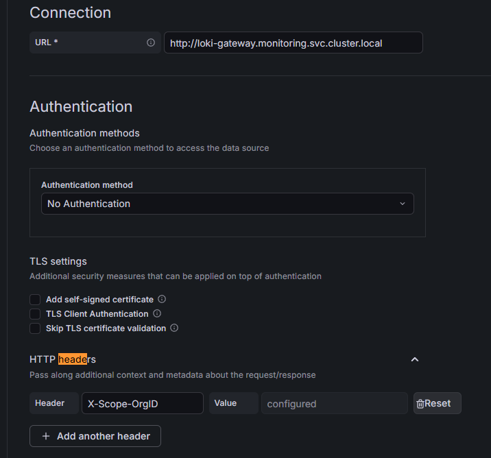

*Grafana обращается к внутреннему Service `loki-gateway` и передаёт tenant в `X-Scope-OrgID`.*

NO DATA

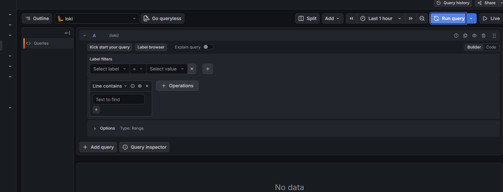

*Пустой запрос в Explore закономерно не возвращает данные.*

В логах Alloy видим ответы HTTP 500: Loki не хватает реплик. Так как Monolithic Loki запущен в одном экземпляре, задаём:

```yaml
loki:
  commonConfig:
    replication_factor: 1
```

Чтобы он работал без репликации.

После исправления выясняется и более простая причина `No data`: в Explore не был задан query.

Воспользуемся разделом Grafana `Drilldown → Logs`, который строит LogQL-запросы автоматически.

Теперь сервисы и их логи видны:

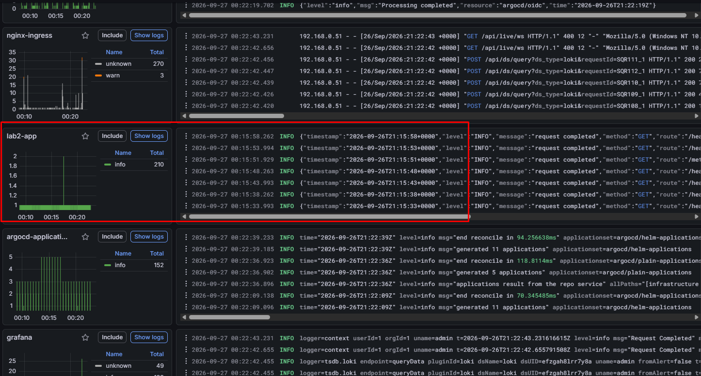

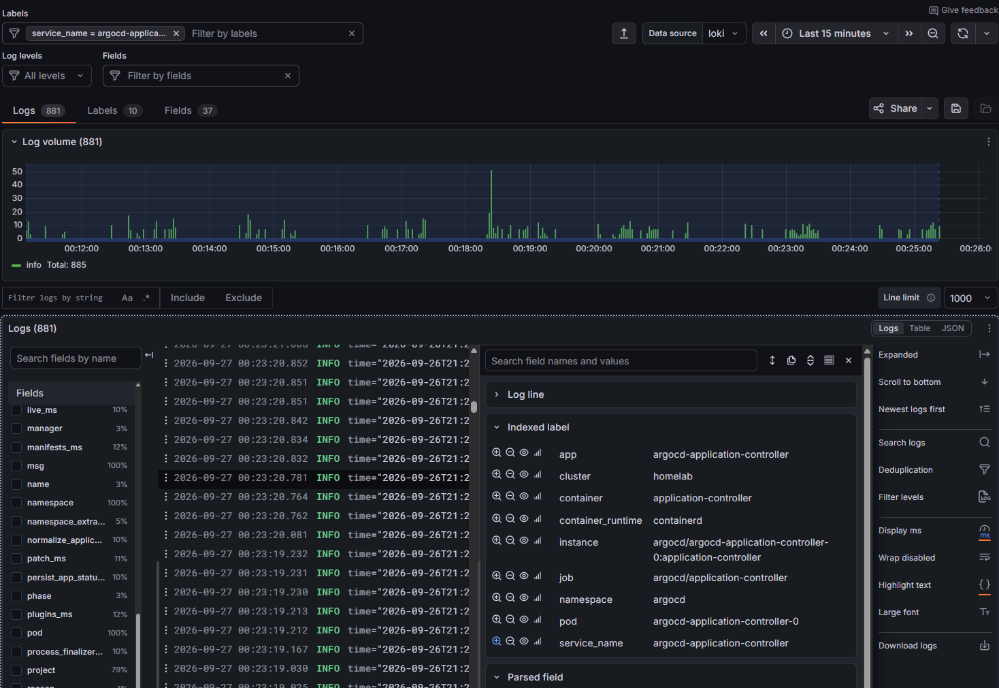

*Детализация потока по indexed labels и извлечённым fields.*

Как ощущается фильтровать логи в интерфейсе новой тулы:


## Part 3 — Трассировки: OpenTelemetry и Jaeger

## Part 4 — Алерты: Alertmanager и Karma
